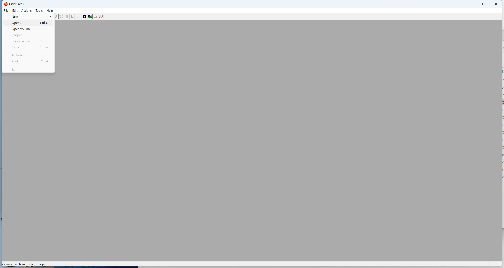
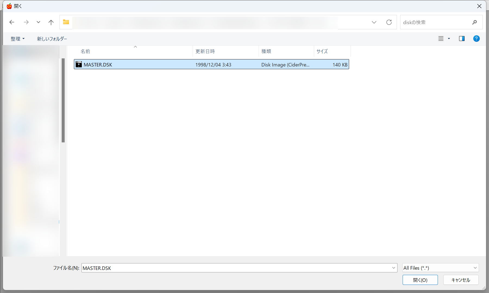
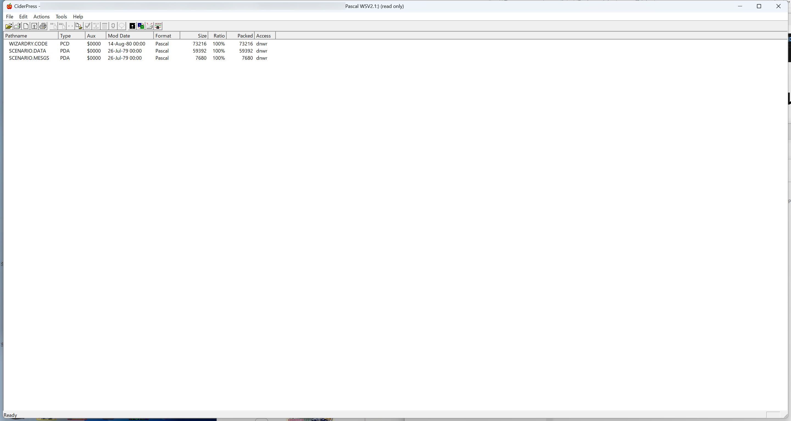
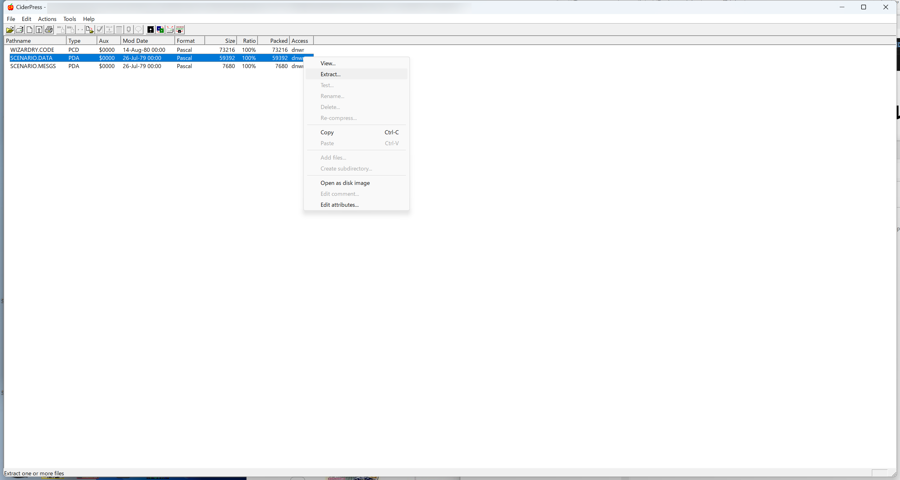
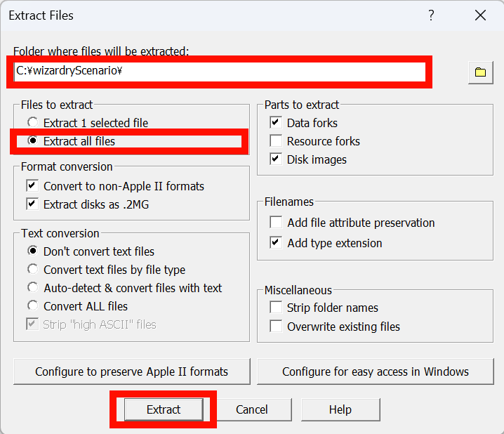
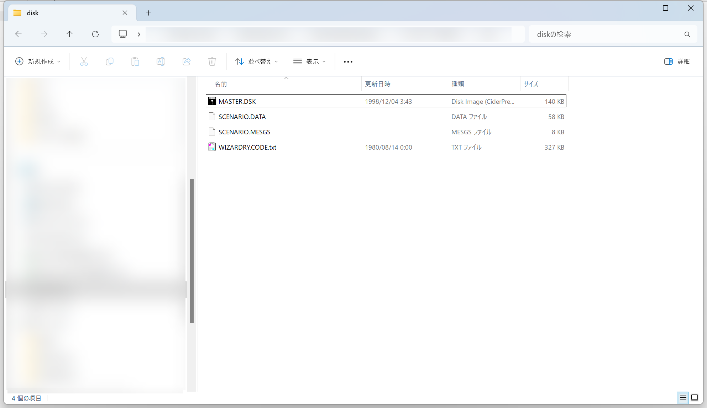

# シナリオ情報ファイルの抽出手順

## 事前準備

本ツールを使用するためには, Wizardryのシナリオ情報ファイル(`SCENARIO.DATA`)とメッセージ情報ファイル(`SCENARIO.MESGS`)とが必要となる。

これらのファイルは, AppleII版Wizardryのマスターディスクイメージ, または, デュプリケイトディスクイメージから抽出することで取得する。

AppleII版のディスクイメージからファイルを抽出するためには, [CiderPress](https://a2ciderpress.com/) などのツールが必要となる。

本文書では, CiderPressを使用して, シナリオ情報ファイルとメッセージ情報ファイルを取得する手順を記載する。

## CiderPressを使用したシナリオ情報ファイル, メッセージ情報ファイル抽出手順

CiderPressを使用したシナリオ情報ファイル, メッセージ情報ファイルを抽出するためには, 以下の作業を実施する。

1. マスターディスクイメージまたはデュプリケイトディスクイメージを取
2. CiderPressを使用して, マスターディスクイメージまたはデュプリケイトディスクイメージを開く
3. シナリオ情報ファイル, メッセージ情報ファイルを抽出する

### マスターディスクイメージまたはデュプリケイトディスクイメージを取得

AppleII版のマスターディスクイメージ, または, デュプリケイトディスクイメージを用意する。

例えば, ローカス社から発売されていた, [ウィザードリィコレクション](https://www.amazon.co.jp/gp/product/4898140076)などから, Wizardryシナリオ1のマスターディスクファイル`MASTER.DSK`を取得する。

### CiderPressを使用して, マスターディスクイメージまたはデュプリケイトディスクイメージを開く

CiderPressを起動し, 前述の手順で取得したマスターディスクイメージまたはデュプリケイトディスクイメージをCiderPressを使用して開く。

まず, CiderPressのメニューの`File`の`Open`を選択する。

ファイル選択ウィンドウが表示されるので, `MASTER.DSK`, または, `DUPLI.DSK`を選択し, `開く`ボタンをクリックする。

正常にファイルを開けた場合, 以下のようなウィンドウが表示される。

### シナリオ情報ファイル, メッセージ情報ファイルを抽出する

CiderPressを使用して, マスターディスクイメージまたはデュプリケイトディスクイメージからシナリオ情報ファイル(`SCENARIO.DATA`)とメッセージ情報ファイル(`SCENARIO.MESGS`)とを取得する。

前述の手順で, CiderPressを使用して, マスターディスクイメージまたはデュプリケイトディスクイメージを開き, 表示されたウィンドウ内の`SCENARIO.DATA`の項目を選択したうえで, 右クリックする。

以下のウィンドウが表示される。
赤枠は, 設定する項目および押下するボタンを表す。

上記の画面で, 以下の項目を設定して, `Extract`ボタンを押下する。

1. `Folder where files will be extracted:`の項目に, 抽出したファイルを出力するディレクトリへのパスを入力する
2. `Files to extract`中の`Extract all files`を選択する

ファイルの抽出が完了すると, シナリオ情報ファイル(`SCENARIO.DATA`), メッセージ情報ファイル(`SCENARIO.MESGS`), および, セグメント情報ファイル(`WIZARDRY.CODE.txt`)が, 出力先に設定したディレクトリに作成される。

本ツールでは, 上記のうち, シナリオ情報ファイル(`SCENARIO.DATA`), メッセージ情報ファイル(`SCENARIO.MESGS`)を使用する。
