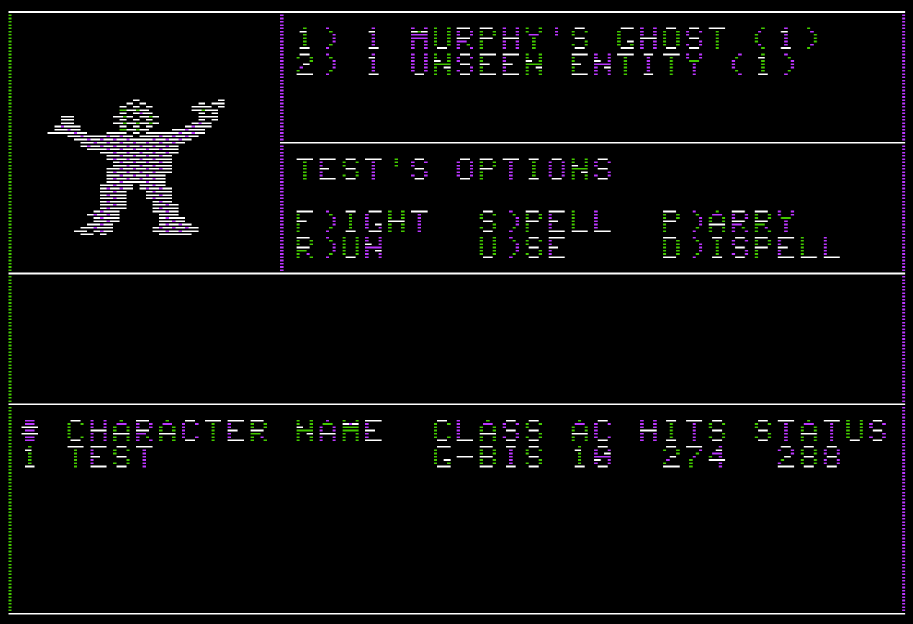

## 高解像度モード (Hi-Res)用キャラクタセットイメージ情報

### Pascalでの定義

```:pascal
    TCHRIMAG = PACKED ARRAY[ 0..7] OF 0..255; (* 8バイト(各バイトは, 1ラインのビットマップ) *)
    CHARSET  : PACKED ARRAY[ 0..63] OF TCHRIMAG; (* 1セット64文字 *)
```

### 高解像度モード (Hi-Res)用キャラクタセットイメージ情報の構造

高解像度モード (Hi-Res)用で文字を表示するための文字イメージのセットを以下の2セット用意している。

1. 通常文字 空白文字(ASCIIコード32番)から'_'(ASCIIコード95)までのフォントを表すビットマップ
2. 全滅時文字(CEMETARY) 全滅時の墓場の画像表示や画面のウィンドウ枠を描画するためのグラフィック文字を表すビットマップ

各セットには, 空白文字(ASCIIコード32番)から'_'(ASCIIコード95)までの合計64文字に対応する文字のビットマップが格納されている。
なお, '@'(アスキーコード64番)に対応するデータには, 通常文字セットの場合, 白塗りの四角形のビットマップが, 全滅時文字セットの場合, 黒塗りの四角形のビットマップがそれぞれ格納されている。

各文字のビットマップは, AppleIIのテキストモードに合わせ, 1文字幅7ピクセル, 高さ8ピクセルで構成される。

高解像度モード (Hi-Res)用キャラクタセットイメージは, ディスク上の1ブロックにつき1セット格納されている。

各文字のビットマップデータは, ディスク上の連続した8バイトの領域に並んで配置されている。

1文字を構成する8バイト長のバイト列は, 読み取り順に, 文字フォントのピクセル行(Y座標)0ピクセル目からピクセル行(Y座標)7ピクセル目までの各行に表示するビットを表す。

文字ピクセルの各行を表す1バイトのデータは, 文字フォント中の各ピクセル行に対する, 0ビット目から6ビット目まで, ピクセル列(X座標)0ピクセル目からピクセル列(Y座標)6ピクセル目の各ビットのON/OFF(点灯/消灯)指示を表す。

例えば, 文字'$'の場合, 以下のバイト列がディスク上に格納されている。

|オフセット(単位:バイト)|16進数での値|2進数での値|
|---|---|---|
|0|00|00000000|
|1|08|00001000|
|2|3C|00111100|
|3|0A|00001010|
|4|1C|00011100|
|5|28|00101000|
|6|1E|00011110|
|7|08|00001000|

上記を0ビット目から6ビット目まで, ビットが立っているところに左から右に点を打つと以下のように$記号になる:

|行/列|0|1|2|3|4|5|6|
|---|---|---|---|---|---|---|---|
|0|□|□|□|□|□|□|□|
|1|□|□|□|■|□|□|□|
|2|□|□|■|■|■|■|□|
|3|□|■|□|■|□|□|□|
|4|□|□|■|■|■|□|□|
|5|□|□|□|■|□|■|□|
|6|□|■|■|■|■|□|□|
|7|□|□|□|■|□|□|□|

### AppleII版Wizardryにおける迷宮探索時の文字表示色についての補足

以下の図に示すように, AppleII版Wizardryの場合, 冒険中の文字の垂直線が白一色ではなく, 緑や紫が混ざった色で表示される。これは, Wizardryのキャラクタセットイメージ定義が原因で発生する現象である。



AppleIIでの各ピクセルの発行色は, 画面上でのピクセルのX座標に応じて決定される。AppleIIで, 白色や黒色を表示するためには, X座標上で連続する2つのピクセルを点灯または消灯させる必要がある(詳細は, [AppleIIビデオメモリにおけるピクセルの6色表示制御](#appleiiビデオメモリにおけるピクセルの6色表示制御) 参照)。

一方, AppleII版Wizardryのキャラクタセットイメージの垂直線は, 横1ピクセル(1ビット)で構成されている。1文字の幅が7ピクセルであるため, 同じビットマップイメージであっても, 幅1ピクセルのドットの発行色は, 文字を表示する座標によって変化する。このため, 同じ文字であっても, 表示される位置によって異なる色で表示される。

例えば, 上記の画面の場合, \"CHARACTER NAME\" の \"A"の文字が, "CHARACTER"と"NAME"との間で, 異なる表示色("CHARACTER"の場合, 垂直線が緑, "NAME"の場合, 垂直線が紫になる)で表示されていることが確認できる。

また, 上記の画面では, \"#\"の中央の空白が紫で塗りつぶされている。これは, 連続した2つのピクセルを消灯するべき所を, 1ピクセルだけ消灯させているため, 隣接するピクセルの色(紫)で解釈されるためである。

なお, 白やユーティリティ, キャンプなどの文字表示はテキストモードで, AppleII内蔵の文字ビットマップを用いて表示されるため各文字は白一色で表示される。
