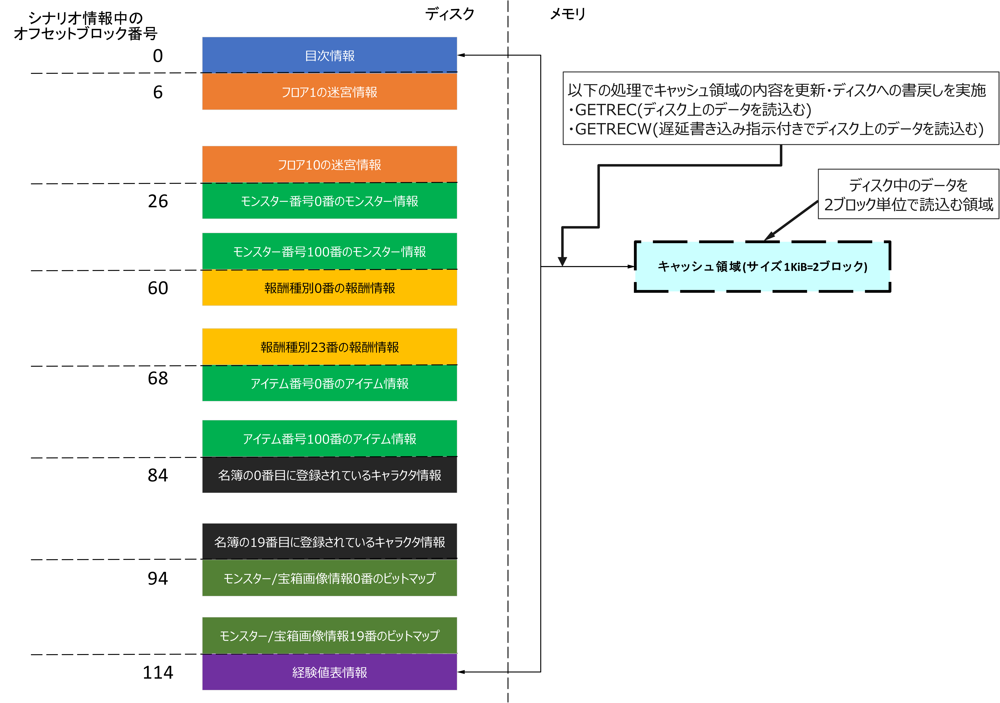
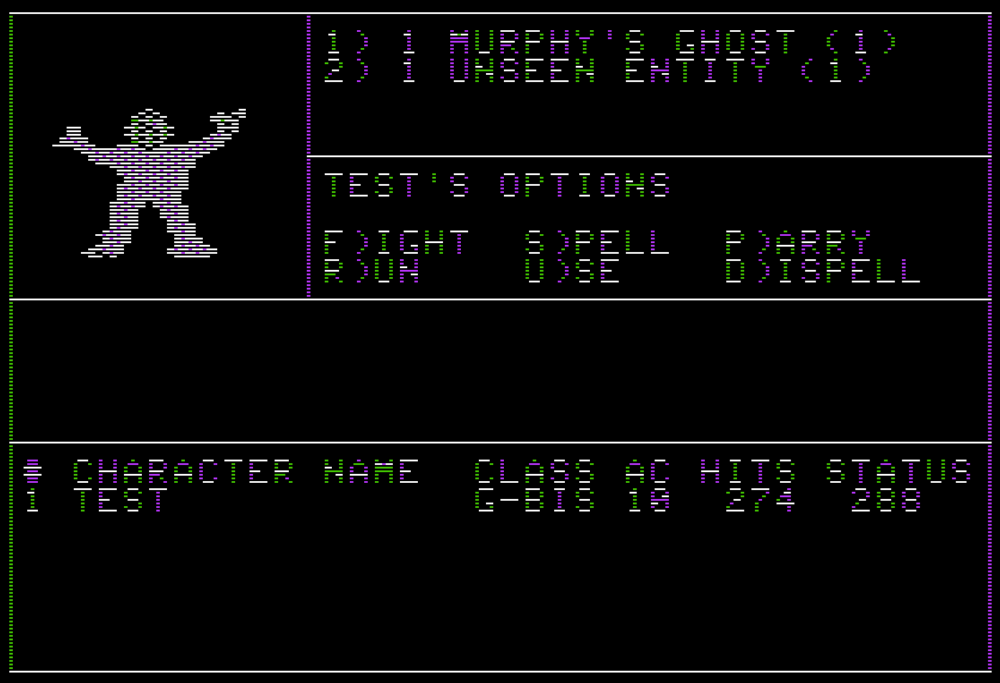

# シナリオデータ構造解説

## 全体構成

本節では, AppleII版 Wizardryのシナリオ情報ファイル(`SCENARIO.DATA`)の構成について述べる。

シナリオ情報ファイルは, 以下の部分から構成される。

1. シナリオ情報共通部
2. 迷宮フロア情報
3. モンスター情報
4. 報酬情報
5. アイテム情報
6. キャラクター名簿情報
7. モンスター/宝箱画像情報
8. 経験値表情報

### シナリオ情報共通部の構造

シナリオ情報共通部は, シナリオ情報ファイルの先頭からブロック単位に以下のように分割して順番に配置される。

|オフセットブロック(単位:ブロック)|シナリオ情報ファイル先頭からのオフセットアドレス(単位:バイト)|格納されている情報|
|---|---|---|
|0|0|目次情報|
|1|512|高解像度モード (Hi-Res)用キャラクタセットイメージ情報(通常文字)|
|2|1024|高解像度モード (Hi-Res)用キャラクタセットイメージ情報(全滅時文字)|
|3|1536|プロテクトコード|
|4|2048|魔術師呪文名一覧|
|5|2560|僧侶呪文名一覧|

上記のうちプロテクトコードについては, 本稿では取り扱わない。

### 迷宮フロア情報, モンスター情報, アイテム情報, キャラクター名簿の構造

シナリオ情報ファイル中の以下の情報は, ディスク上の連続する1KiB分のディスクブロック(2ブロック)を単位として格納されている。

1. 迷宮フロア情報
2. モンスター情報
3. アイテム情報情報
4. キャラクター名簿情報

各情報のデータ長に応じて, 1KiBに格納可能な個数のデータが連続して各領域に格納される。1KiB以内に全てのデータを格納できない場合は, 次の1KiBのデータブロック境界から, データを格納を再開する。

シナリオ情報は, 一度メモリ中のキャッシュ領域に読み込まれ, プログラム中からはキャッシュ領域中のデータを参照することで, シナリオ情報の内容にアクセスする。

#### AppleII版 Wizardryでのキャッシュ領域の扱い

AppleII版 Wizardryでは, キャッシュ領域は, 以下のような1KiBのバイト配列(CHAR型の配列)として定義されている:

```:pascal
IOCACHE  : PACKED ARRAY[ 0..1023] OF CHAR;
```

シナリオ情報の各要素には, 以下の列挙型`TZSCN`で定義されたシナリオ情報種別を表す列挙子がつけられている。

```:pascal
        TZSCN = (ZZERO, ZMAZE, ZENEMY, ZREWARD, ZOBJECT,
                        ZCHAR, ZSPCCHRS, ZEXP); (* シナリオ情報種別 *)
```

シナリオ情報種別と格納されている情報の関係は以下の通り:

|列挙子|列挙値|意味|シナリオ1での総要素数|
|---|---|---|---|
|ZZERO|0|シナリオ情報の目次情報(目次情報)|1|
|ZMAZE|1|迷宮内の各フロアのマップ, フロア内のイベント情報(迷宮フロア情報)|10|
|ZENEMY|2|各モンスターのパラメタ値(モンスター情報)|101|
|ZREWARD|3|宝箱から得られるお金, アイテムの情報(報酬情報)|24|
|ZOBJECT|5|各アイテムのパラメタ値(アイテム情報)|101|
|ZCHAR|6|訓練場で作成したキャラクタの情報(キャラクタ名簿情報)|20|
|ZSPCCHRS|7|魔物/宝箱/報酬のグラフィック(モンスター/宝箱画像情報)|20|
|ZEXP|8|各職業で次のレベルに上がるための累積経験値, レベル13からレベル14に上がるための差分経験値を格納した表(経験値表情報)|1|

プログラム中で, GETREC関数, GETRECW関数を用いることで, ディスク上のシナリオ情報が, メモリ中のキャッシュ領域(IOCACHE変数)に読み込まれる(下図参照)。



GETREC, GETRECWは, 読みだす情報のシナリオ情報種別と対象情報種別内での連番, データ長を指定することで読込み対象の情報をキャッシュ領域に読み込み, 読込み対象の情報のキャッシュ領域内でのオフセットアドレスを返却する関数である。

GETREC, GETRECWの返却値をIOCACHE変数の添え字に指定することで, シナリオ情報中のデータ構造にアクセスすることができる。

GETREC, GETRECWは, 現在キャッシュ中に読み込まれているディスク上のブロックを大域変数`CACHEBL`に保持しており, 同一のディスクブロックからの読み出し時には, ディスクへのアクセスを抑止することで, ディスクI/O負荷を軽減する。

キャッシュ領域中のシナリオ情報をディスク上に書き戻す場合は,
GETRECW関数を用いて, 更新対象のデータをキャッシュ中に読み込む。 GETRECW関数呼び出すと, キャッシュ領域の書き戻し要求フラグ(`CACHEWRI`大域変数)がセットされる。

後続のGETREC, GETRECWの呼び出しに伴い, 現在キャッシュ領域に格納されているブロック群(2ブロック)と異なるディスクブロックからデータを読み出す際に, キャッシュ領域の内容をディスク上に書き戻してから要求されたブロックの内容をキャッシュ領域に読み込む。

例えば, ギルガメッシュの酒場でのパーティメンバの追加など, シナリオ情報への書き戻しが必要な場合は, GETREC関数を使用して, データを読み込んだ後, GETRECWを使用してデータの書き戻しを指示する。 これにより, (名簿参照やアイテム情報参照に伴う)後続のGETREC呼び出し時に, 更新後のパーティメンバ編成など更新があった情報がディスクに書き戻される。

#### ディスク上のシナリオ情報読み取り開始ブロック算出式

キャッシュ領域中には, ディスク上で2ブロック分の情報が格納される。このため, ディスク上のブロック読込開始位置(単位:ブロック)は, 以下の式で算出される。

```:text
ブロック読込開始位置(シナリオ情報開始ブロックからの相対ブロック数) = ディスク上でのブロックオフセット + 2 * ( データエントリのインデクス(配列の添え字) / キャッシュ領域に格納可能なデータ数 )
```

#### キャッシュ領域内の読み取り対象データ格納位置算出式

キャッシュ領域内の読み取り対象データ格納位置は, 以下の式で算出される。以下で算出される値は, キャッシュ領域の戦闘アドレスからのオフセットアドレス(単位:バイト)であり, キャッシュ領域を表す大域変数IOCACHE配列の添え字として用いられる。

```:text
キャッシュ領域内でのオフセットアドレス = データサイズ * ( データエントリのインデクス(配列の添え字) % キャッシュ領域に格納可能なデータ数 )
```

#### シナリオ情報中のデータ参照処理の例

例えば, アイテム情報14番(HELM)の場合, アイテム情報1エントリ当たりのサイズが78バイトであること, キャッシュ領域のサイズが1KiB(1024バイト)であることから, キャッシュ領域に格納可能なデータ(アイテム情報)の数は, 以下の式により13個となる:

```:text
キャッシュ領域に格納可能なデータ(アイテム情報)の数 = キャッシュ領域サイズ / アイテム情報のデータサイズ = 1024 / 78 = 13
```

ブロック読込開始位置算出式, キャッシュ領域内の読み取り対象データ格納位置算出式で用いるパラメタは以下のようになる:

- ディスク上でのブロックオフセット(単位:ブロック): 68
- データエントリのインデクス(配列の添え字): 14
- データサイズ(単位:バイト): 78
- キャッシュ領域に格納可能なデータ数: 13

ブロック読込開始位置は以下のように算出される:

```:text
ブロック読込開始位置(シナリオ情報開始ブロックからの相対ブロック数) = 68 + 2 * ( 14 / 13 ) = 68 + 2 * 1 = 70ブロック
```

キャッシュ領域内でのオフセットアドレスは以下のように算出される:

```:text
キャッシュ領域内でのオフセットアドレス = 78 * ( 14 % 13 ) = 78 * 1 = 78
```

上記から, 70ブロック目は偶数ブロックであるため, キャッシュ領域には, 70ブロックから71ブロックの内容が格納され, キャッシュ領域のオフセット位置78バイト目の位置に, HELMの情報が格納される。

ディスク上のシナリオ情報中の70ブロック目の内容は, 以下のようになっており, 上記の式で算出されたオフセット78バイト目(16進数で0x4E)の位置に, HELMの情報が格納されていることが確認できる。


## 目次情報

### Pascalでの定義

```:pascal
        TSCNTOC = RECORD (* シナリオ情報 *)
            GAMENAME : STRING[ 40]; (* シナリオ名(シナリオ1の場合, 'PROVING GROUNDS OF THE MAD OVERLORD!') *)
            RECPER2B : ARRAY[ ZZERO..ZEXP] OF INTEGER; (* キャッシュ領域(1KiB)に格納可能なデータ数 *)
            RECPERDK : ARRAY[ ZZERO..ZEXP] OF INTEGER; (* 各シナリオ情報の最大データエントリ数 *)
            UNUSEDXX : ARRAY[ ZZERO..ZEXP] OF INTEGER; (* 未使用 *)
            BLOFF    : ARRAY[ ZZERO..ZEXP] OF INTEGER; (* 各シナリオ情報の格納先ディスクブロック番号 *)
            RACE     : ARRAY[ NORACE..HOBBIT]         OF STRING[ 9]; (* 種族を表す文字列(9文字) *)
            CLASS    : PACKED ARRAY[ FIGHTER..NINJA]  OF STRING[ 9]; (* 職業を表す文字列(9文字) *)
            STATUS   : ARRAY[ OK..LOST]               OF STRING[ 8]; (* 状態を表す文字列(8文字) *)
            ALIGN    : PACKED ARRAY[ UNALIGN..EVIL]   OF STRING[ 9]; (* 属性(アラインメント)を表す文字列(9文字) *)
            SPELLHSH : PACKED ARRAY[ 0..50] OF INTEGER;              (* 各呪文の連番から識別番号への変換テーブル *)
            SPELLGRP : PACKED ARRAY[ 0..50] OF 0..7;                 (* 各呪文の連番から呪文レベルへの変換テーブル *)
            SPELL012 : PACKED ARRAY[ 0..50] OF TSPEL012;             (* 各呪文の連番から呪文種別(対象者選択時に使用)への変換テーブル *)
          END;
```

### 目次情報データ構造

|メンバ名|オフセット(単位:バイト)|サイズ(単位:バイト)|意味|
|---|---|---|---|
|GAMENAME|0|41|シナリオ名のPascal文字列|
|RECPER2B[0]|42|2|キャッシュ領域に格納可能なZZERO(目次情報)の数(単位:個)|
|RECPER2B[1]|44|2|キャッシュ領域に格納可能なZMAZE(迷宮フロア情報)の数(単位:個)|
|RECPER2B[2]|46|2|キャッシュ領域に格納可能なZENEMY(モンスター情報)の数(単位:個)|
|RECPER2B[3]|48|2|キャッシュ領域に格納可能なZREWARD(報酬情報)の数(単位:個)|
|RECPER2B[4]|50|2|キャッシュ領域に格納可能なZOBJECT(アイテム情報)の数(単位:個)|
|RECPER2B[5]|52|2|キャッシュ領域に格納可能なZCHAR(キャラクタ情報)の数(単位:個)|
|RECPER2B[6]|54|2|キャッシュ領域に格納可能なZSPCCHRS(モンスターグラフィック情報)の数(単位:個)|
|RECPER2B[7]|56|2|キャッシュ領域に格納可能なZEXP(経験値表)|
|RECPERDK[0]|58|2|ZZERO(目次情報)の数|
|RECPERDK[1]|60|2|ZMAZE(フロア情報)の数|
|RECPERDK[2]|62|2|ZENEMY(モンスター情報)の数|
|RECPERDK[3]|64|2|ZREWARD(報酬情報)の数|
|RECPERDK[4]|66|2|ZOBJECT(アイテム情報)の数|
|RECPERDK[5]|68|2|ZCHAR(キャラクタ情報)の数|
|RECPERDK[6]|70|2|ZSPCCHRS(モンスターグラフィック情報)の数|
|RECPERDK[7]|72|2|ZEXP(経験値表)の数|
|UNUSEDXX[0]|74|2|ZZERO(目次情報)未使用情報|
|UNUSEDXX[1]|76|2|ZMAZE(迷宮フロア情報)未使用情報|
|UNUSEDXX[2]|78|2|ZENEMY(モンスター情報)未使用情報|
|UNUSEDXX[3]|80|2|ZREWARD(報酬情報)未使用情報|
|UNUSEDXX[4]|82|2|ZOBJECT(アイテム情報)未使用情報|
|UNUSEDXX[5]|84|2|ZCHAR(キャラクタ情報)未使用情報|
|UNUSEDXX[6]|86|2|ZSPCCHRS(モンスターグラフィック情報)未使用情報|
|UNUSEDXX[7]|88|2|ZEXP(経験値表)未使用情報|
|BLOFF[0]|90|2|ZZERO(目次情報)ブロックオフセット|
|BLOFF[1]|92|2|ZMAZE(迷宮フロア情報)ブロックオフセット|
|BLOFF[2]|94|2|ZENEMY(モンスター情報)ブロックオフセット|
|BLOFF[3]|96|2|ZREWARD(報酬情報)ブロックオフセット|
|BLOFF[4]|98|2|ZOBJECT(アイテム情報)ブロックオフセット|
|BLOFF[5]|100|2|ZCHAR(キャラクタ情報)ブロックオフセット|
|BLOFF[6]|102|2|ZSPCCHRS(モンスターグラフィック情報)ブロックオフセット|
|BLOFF[7]|104|2|ZEXP(経験値表)ブロックオフセット|
|RACE[0]|106|10|NORACE種族名|
|RACE[1]|116|10|HUMAN種族名|
|RACE[2]|126|10|ELF種族名|
|RACE[3]|136|10|DWARF種族名|
|RACE[4]|146|10|GNOME種族名|
|RACE[5]|156|10|HOBBIT種族名|
|CLASS[0]|166|10|FIGHTER職業名|
|CLASS[1]|176|10|MAGE職業名|
|CLASS[2]|186|10|PRIEST職業名|
|CLASS[3]|196|10|THIEF職業名|
|CLASS[4]|206|10|BISHOP職業名|
|CLASS[5]|216|10|SAMURAI職業名|
|CLASS[6]|226|10|LORD職業名|
|CLASS[7]|236|10|NINJA職業名|
|STATUS[0]|246|9|OK状態名|
|STATUS[1]|256|9|AFRAID状態名|
|STATUS[2]|266|9|ASLEEP状態名|
|STATUS[3]|276|9|P-LYZE状態名|
|STATUS[4]|286|9|STONED状態名|
|STATUS[5]|296|9|DEAD状態名|
|STATUS[6]|306|9|ASHES状態名|
|STATUS[7]|316|9|LOST状態名|
|ALIGN[0]|326|10|NOALIGN属性(アラインメント)名|
|ALIGN[1]|336|10|GOOD属性(アラインメント)名|
|ALIGN[2]|346|10|NEUTRAL属性(アラインメント)名|
|ALIGN[3]|356|10|EVIL属性(アラインメント)名|
|SPELLHSH[0]|366|2|無効呪文識別番号(-1)|
|SPELLHSH[1]|368|2|HALITO呪文識別番号(SPELLHSHのハッシュ値)|
|SPELLHSH[2]|370|2|MOGREF呪文識別番号(SPELLHSHのハッシュ値)|
|SPELLHSH[3]|372|2|KATINO呪文識別番号(SPELLHSHのハッシュ値)|
|SPELLHSH[4]|374|2|DUMAPIC呪文識別番号(SPELLHSHのハッシュ値)|
|SPELLHSH[5]|376|2|DILTO呪文識別番号(SPELLHSHのハッシュ値)|
|SPELLHSH[6]|378|2|SOPIC呪文識別番号(SPELLHSHのハッシュ値)|
|SPELLHSH[7]|380|2|MAHALITO呪文識別番号(SPELLHSHのハッシュ値)|
|SPELLHSH[8]|382|2|MOLITO呪文識別番号(SPELLHSHのハッシュ値)|
|SPELLHSH[9]|384|2|MORLIS呪文識別番号(SPELLHSHのハッシュ値)|
|SPELLHSH[10]|386|2|DALTO呪文識別番号(SPELLHSHのハッシュ値)|
|SPELLHSH[11]|388|2|LAHALITO呪文識別番号(SPELLHSHのハッシュ値)|
|SPELLHSH[12]|390|2|MAMORLIS呪文識別番号(SPELLHSHのハッシュ値)|
|SPELLHSH[13]|392|2|MAKANITO呪文識別番号(SPELLHSHのハッシュ値)|
|SPELLHSH[14]|394|2|MADALTO呪文識別番号(SPELLHSHのハッシュ値)|
|SPELLHSH[15]|396|2|LAKANITO呪文識別番号(SPELLHSHのハッシュ値)|
|SPELLHSH[16]|398|2|ZILWAN呪文識別番号(SPELLHSHのハッシュ値)|
|SPELLHSH[17]|400|2|MASOPIC呪文識別番号(SPELLHSHのハッシュ値)|
|SPELLHSH[18]|402|2|HAMAN呪文識別番号(SPELLHSHのハッシュ値)|
|SPELLHSH[19]|404|2|MALOR呪文識別番号(SPELLHSHのハッシュ値)|
|SPELLHSH[20]|406|2|MAHAMAN呪文識別番号(SPELLHSHのハッシュ値)|
|SPELLHSH[21]|408|2|TILTOWAIT呪文識別番号(SPELLHSHのハッシュ値)|
|SPELLHSH[22]|410|2|KALKI呪文識別番号(SPELLHSHのハッシュ値)|
|SPELLHSH[23]|412|2|DIOS呪文識別番号(SPELLHSHのハッシュ値)|
|SPELLHSH[24]|414|2|BADIOS呪文識別番号(SPELLHSHのハッシュ値)|
|SPELLHSH[25]|416|2|MILWA呪文識別番号(SPELLHSHのハッシュ値)|
|SPELLHSH[26]|418|2|PORFIC呪文識別番号(SPELLHSHのハッシュ値)|
|SPELLHSH[27]|420|2|MATU呪文識別番号(SPELLHSHのハッシュ値)|
|SPELLHSH[28]|422|2|CALFO呪文識別番号(SPELLHSHのハッシュ値)|
|SPELLHSH[29]|424|2|MANIFO呪文識別番号(SPELLHSHのハッシュ値)|
|SPELLHSH[30]|426|2|MONTINO呪文識別番号(SPELLHSHのハッシュ値)|
|SPELLHSH[31]|428|2|LOMILWA呪文識別番号(SPELLHSHのハッシュ値)|
|SPELLHSH[32]|430|2|DIALKO呪文識別番号(SPELLHSHのハッシュ値)|
|SPELLHSH[33]|432|2|LATUMAPIC呪文識別番号(SPELLHSHのハッシュ値)|
|SPELLHSH[34]|434|2|BAMATU呪文識別番号(SPELLHSHのハッシュ値)|
|SPELLHSH[35]|436|2|DIAL呪文識別番号(SPELLHSHのハッシュ値)|
|SPELLHSH[36]|438|2|BADIAL呪文識別番号(SPELLHSHのハッシュ値)|
|SPELLHSH[37]|440|2|LATUMOFIS呪文識別番号(SPELLHSHのハッシュ値)|
|SPELLHSH[38]|442|2|MAPORFIC呪文識別番号(SPELLHSHのハッシュ値)|
|SPELLHSH[39]|444|2|DIALMA呪文識別番号(SPELLHSHのハッシュ値)|
|SPELLHSH[40]|446|2|BADIALMA呪文識別番号(SPELLHSHのハッシュ値)|
|SPELLHSH[41]|448|2|LITOKAN呪文識別番号(SPELLHSHのハッシュ値)|
|SPELLHSH[42]|450|2|KANDI呪文識別番号(SPELLHSHのハッシュ値)|
|SPELLHSH[43]|452|2|DI呪文識別番号(SPELLHSHのハッシュ値)|
|SPELLHSH[44]|454|2|BADI呪文識別番号(SPELLHSHのハッシュ値)|
|SPELLHSH[45]|456|2|LORTO呪文識別番号(SPELLHSHのハッシュ値)|
|SPELLHSH[46]|458|2|MADI呪文識別番号(SPELLHSHのハッシュ値)|
|SPELLHSH[47]|460|2|MABADI呪文識別番号(SPELLHSHのハッシュ値)|
|SPELLHSH[48]|462|2|LOKTOFEIT呪文識別番号(SPELLHSHのハッシュ値)|
|SPELLHSH[49]|464|2|MALIKTO呪文識別番号(SPELLHSHのハッシュ値)|
|SPELLHSH[50]|466|2|KADORTO呪文識別番号(SPELLHSHのハッシュ値)|
|SPELLGRP[0-4]|468|2|2進数3桁であらわした無効呪文, HALITO,MOGREF,KATINO,DUMAPICの呪文レベル|
|SPELLGRP[5-9]|470|2|2進数3桁であらわしたDILTO,SOPIC, MAHALITO,MOLITO,MORLISの呪文レベル|
|SPELLGRP[10-14]|472|2|2進数3桁であらわしたDALTO,LAHALITO, MAMORLIS, MAKANITO, MADALTOの呪文レベル|
|SPELLGRP[15-19]|474|2|2進数3桁であらわしたLAKANITO,ZILWAN,MASOPIC,HAMAN, MALORの呪文レベル|
|SPELLGRP[20-24]|476|2|2進数3桁であらわしたMAHAMAN,TILTOWAIT,KALKI,DIOS,BADIOSの呪文レベル|
|SPELLGRP[25-29]|478|2|2進数3桁であらわしたMILWA,PORFIC,MATU,CALFO,MANIFOの呪文レベル|
|SPELLGRP[30-34]|480|2|2進数3桁であらわしたMONTINO,LOMILWA,DIALKO,LATUMAPIC,BAMATUの呪文レベル|
|SPELLGRP[35-39]|482|2|2進数で3桁であらわしたDIAL,BADIAL,LATUMOFIS,MAPORFIC,DIALMAの呪文レベル|
|SPELLGRP[40-44]|484|2|2進数で3桁であらわしたBADIALMA,LITOKAN,KANDI,DI,BADIの呪文レベル|
|SPELLGRP[45-49]|486|2|2進数で3桁であらわしたLORTO,MADI,MABADI,LOKTOFEIT,MALIKTOの呪文レベル|
|SPELLGRP[50]|488|2|2進数で3桁であらわしたKADORTOの呪文レベル|
|SPELL012[0-7] |490|2|2進数で2桁であらわした無効呪文,HALITO,MOGREF,KATINO,DUMAPIC,DILTO,SOPIC,MAHALITOの呪文種別|
|SPELL012[8-15] |492|2|2進数で2桁であらわしたMOLITO,MORLIS,DALTO,LAHALITO, MAMORLIS, MAKANITO, MADALTO, LAKANITOの呪文種別|
|SPELL012[16-23] |494|2|2進数で2桁であらわしたZILWAN, MASOPIC,HAMAN,MALOR,MAHAMAN,TILTOWAIT,KALKI,DIOSの呪文種別|
|SPELL012[24-31] |496|2|2進数で2桁であらわしたBADIOS,MILWA,PORFIC,MATU,CALFO,MANIFO,MONTINO,LOMILWAの呪文種別|
|SPELL012[32-39] |498|2|2進数で2桁であらわしたDIALKO,LATUMAPIC,BAMATU,DIAL,BADIAL,LATUMOFIS,MAPORFIC,DIALMAの呪文種別|
|SPELL012[40-47] |500|2|2進数で2桁であらわしたBADIALMA,LITOKAN,KANDI,DI,BADI,LORTO,MADI,MABADIの呪文種別|
|SPELL012[48-50] |502|2|2進数で2桁であらわしたLOKTOFEIT,MALIKTO,KADORTOの呪文種別|

## 高解像度モード (Hi-Res)用キャラクタセットイメージ情報

### Pascalでの定義

```:pascal
    TCHRIMAG = PACKED ARRAY[ 0..7] OF 0..255; (* 8バイト(各バイトは, 1ラインのビットマップ) *)
    CHARSET  : PACKED ARRAY[ 0..63] OF TCHRIMAG; (* 1セット64文字 *)
```

### 高解像度モード (Hi-Res)用キャラクタセットイメージ情報の構造

高解像度モード (Hi-Res)用で文字を表示するための文字イメージのセットを以下の2セット用意している。

1. 通常文字 空白文字(ASCIIコード32番)から'_'(ASCIIコード95)までのフォントを表すビットマップ
2. 全滅時文字(CEMETARY) 全滅時の墓場の画像表示や画面のウィンドウ枠を描画するためのグラフィック文字を表すビットマップ

各セットには, 空白文字(ASCIIコード32番)から'_'(ASCIIコード95)までの合計64文字に対応する文字のビットマップが格納されている。
なお, '@'(アスキーコード64番)に対応するデータには, 通常文字セットの場合, 白塗りの四角形のビットマップが, 全滅時文字セットの場合, 黒塗りの四角形のビットマップがそれぞれ格納されている。

各文字のビットマップは, AppleIIのテキストモードに合わせ, 1文字幅7ピクセル, 高さ8ピクセルで構成される。

高解像度モード (Hi-Res)用キャラクタセットイメージは, ディスク上の1ブロックにつき1セット格納されている。

各文字のビットマップデータは, ディスク上の連続した8バイトの領域に並んで配置されている。

1文字を構成する8バイト長のバイト列は, 読み取り順に, 文字フォントのピクセル行(Y座標)0ピクセル目からピクセル行(Y座標)7ピクセル目までの各行に表示するビットを表す。

文字ピクセルの各行を表す1バイトのデータは, 文字フォント中の各ピクセル行に対する, 0ビット目から6ビット目まで, ピクセル列(X座標)0ピクセル目からピクセル列(Y座標)6ピクセル目の各ビットのON/OFF(点灯/消灯)指示を表す。

例えば, 文字'$'の場合, 以下のバイト列がディスク上に格納されている。

|オフセット(単位:バイト)|16進数での値|2進数での値|
|---|---|---|
|0|00|00000000|
|1|08|00001000|
|2|3C|00111100|
|3|0A|00001010|
|4|1C|00011100|
|5|28|00101000|
|6|1E|00011110|
|7|08|00001000|

上記を0ビット目から6ビット目まで, ビットが立っているところに左から右に点を打つと以下のように$記号になる:

|行/列|0|1|2|3|4|5|6|
|---|---|---|---|---|---|---|---|
|0|□|□|□|□|□|□|□|
|1|□|□|□|■|□|□|□|
|2|□|□|■|■|■|■|□|
|3|□|■|□|■|□|□|□|
|4|□|□|■|■|■|□|□|
|5|□|□|□|■|□|■|□|
|6|□|■|■|■|■|□|□|
|7|□|□|□|■|□|□|□|

### AppleII版Wizardryにおける迷宮探索時の文字表示色についての補足

以下の図に示すように, AppleII版Wizardryの場合, 冒険中の文字の垂直線が白一色ではなく, 緑や紫が混ざった色で表示される。



AppleIIでの各ピクセルの発行色は, 画面上でのピクセルのX座標に応じて決定される。AppleIIで, 白色や黒色を表示するためには, X座標上で連続する2つのピクセルを点灯または消灯させる必要がある。
詳細は, [AppleIIビデオメモリにおけるピクセルの6色表示制御](#appleiiビデオメモリにおけるピクセルの6色表示制御) 参照。

一方, AppleII版Wizardryのキャラクタセットイメージの垂直線は, 横1ピクセル(1ビット)で構成されている。1文字の幅が7ピクセルであるため, 同じビットマップイメージであっても, 幅1ピクセルのドットの発行色は, 文字を表示する座標によって変化する。このため, 同じ文字であっても, 表示される位置によって表示色が異なる結果となっている。

上記の画面の場合, \"CHARACTER NAME\" の \"A"の文字が, "CHARACTER"と"NAME"との間で, 異なる表示色("CHARACTER"の場合, 垂直線が緑, "NAME"の場合, 垂直線が紫になる)で表示されていることが確認できる。

また, 上記の画面で, \"#\"の中央の空白が紫で塗りつぶされている。これは, 連続した2つのピクセルを消灯するべき所を, 1ピクセルだけ消灯させているため, 隣接するピクセルの色(紫)で解釈されているためである。

なお, 白やユーティリティ, キャンプなどの文字表示はテキストモードで, AppleII内蔵の文字ビットマップを用いて表示されるため各文字は白一色で表示される。

## 付録

### AppleII高解像度グラフィックス領域

#### AppleII高解像度グラフィックス領域の構成

AppleIIの高解像度グラフィックス領域のy座標は, 以下のように分割される:

- Y座標全体は連続した3つの「ブロック」に分割される
- 各ブロックは8つの「ボックス行」に分割される
- 各ボックス行は8つの「ライン行」に分割される

#### 画面上のピクセル座標(x,y)からビデオメモリ書込先アドレスの算出手順

ビデオメモリアドレス上は, 前述の「ブロック」,「ボックス行」, 「ライン行」を以下のように配置している。

- ライン行の幅は40バイトで、どのライン行にも連続したアドレスが64個並んでおり, ライン行内の開始アドレスからのオフセットによって画面上で描画する際のx座標を決定する
- 隣接するボックス行間は, 128バイト離れて配置される
- ボックス行内のライン行間は, 1024バイト離れて配置される

以上から, 画面上の(x,y)座標のピクセルからピクセル情報を設定する場合に使用するビデオメモリアドレスの算出パラメタは, 以下のようになる。

1. ビデオメモリのX座標(列番号)に対応したオフセットアドレス(単位:バイト): x // 7
2. ブロック番号に対応したオフセットアドレス(単位:バイト): 40 \* ( y // 64 )
3. ボックス行番号に対応したオフセットアドレス(単位:バイト): 128 * ( y % 64 ) // 8
4. ボックス行内のライン行に対応したオフセットアドレス(単位:バイト): 1024 \* 8 \* ( y % 8 )

上記の総和が, 出力先のビデオメモリアドレスとなる。

#### AppleIIビデオメモリにおけるピクセルの6色表示制御

AppleIIでは, 1バイトのデータをビデオメモリに書き込むことで, 連続した7ピクセルのON/OFF(発光の有無)を制御する。

書き込みデータ(ビデオメモリに書込む1バイトのデータ)の構成は, 以下の通り(なお, 信号の位相に依存する発色となるため, 実機上は, 明確な青色, 紫色, 燈色, 緑色, 白色, 黒色として表示されるわけではないが, 便宜上以下では, 青色, 紫色, 燈色, 白色, 黒色と表記する):

- 0から6ビット目 発光指示ビット
  0ビットから6ビット目までの画面上の各ビットのON/OFFで左から右へピクセルの
  発光のON/OFFを決定する。

  - ビットが0の場合
    発光しない(黒色になる)

  - ビットが1の場合

    a. 直前(画面左側)のピクセルのビットが立っている場合
       両者のピクセルの色が補色の関係(緑,紫の組, または, 橙,青の組)にある場合は, 対象ピクセルを白として発光する(補色により白に見える)。

    b. 直後(画面左側)のピクセルのビットが立っている場合
       両者のピクセルの色が補色の関係(緑,紫の組, または, 橙,青の組)にある場合は, 対象ピクセルを白として発光する(補色により白に見える)。

    c. 上記以外の場合(対象ピクセルに隣接するピクセルが発光していない場合)
       書き込みデータ7ビット目のカラー選択ビットと対象ビットによって発光されるビデオメモリ上のピクセルのX座標の値によって, 発光色を決定する。

- 7ビット目  カラー選択ビット
  最上位ビットは, カラー選択ビットとなっており, 直前のピクセルのビットが
  立っていない場合, バイトの最上位ビットと対象ビットによって発光される
  ビデオメモリ上のピクセルのX座標の値によって, 発光色を選択する。

発光色の選択は, 以下のように決定される。

  1. ビデオメモリ上のピクセルのX座標が偶数の場合, かつ,

     a. カラー選択ビットが立っていたら, 青色を発光する。

     b. カラー選択ビットが立っていなければ, 紫色を発光する。

  2. ビデオメモリ上のピクセルのX座標が奇数の場合, かつ,

     a. カラー選択ビットが立っていたら, 橙色を発光する。

     b. カラー選択ビットが立っていなければ, 緑色を発光する。

## 参考文献

1. E. S. Desa, E. J. D'Sa, [Memory Addressing the Apple Graphics Screen](https://drs.nio.res.in/drs/bitstream/handle/2264/6214/Comput_Sci_Inf_15_23.pdf?sequence=1&isAllowed=y)
2. Ken Williams, Bab Kernaghan, Lisa Kernaghan, APPLE II COMPUTER GRAPHICS, Prentice-Hall Publishing and Communications Company, 1983
3. Apple Computer, AppleII Apple Pascal Language Reference Manual, Apple Computer, 1980
4. Apple Computer, AppleII Apple Pascal Operating System Reference Manual, Apple Computer, 1980
5. SAGE computer technology, p-System Editors Pascal Assembler, SAGE computer technology, 1980
6. Andrew Greenberg, Robert Woodhead, Wizardry A Game of Fantasy & Adventure Player's Manual Third Edition, SIR-TECH Software Inc., 1981
