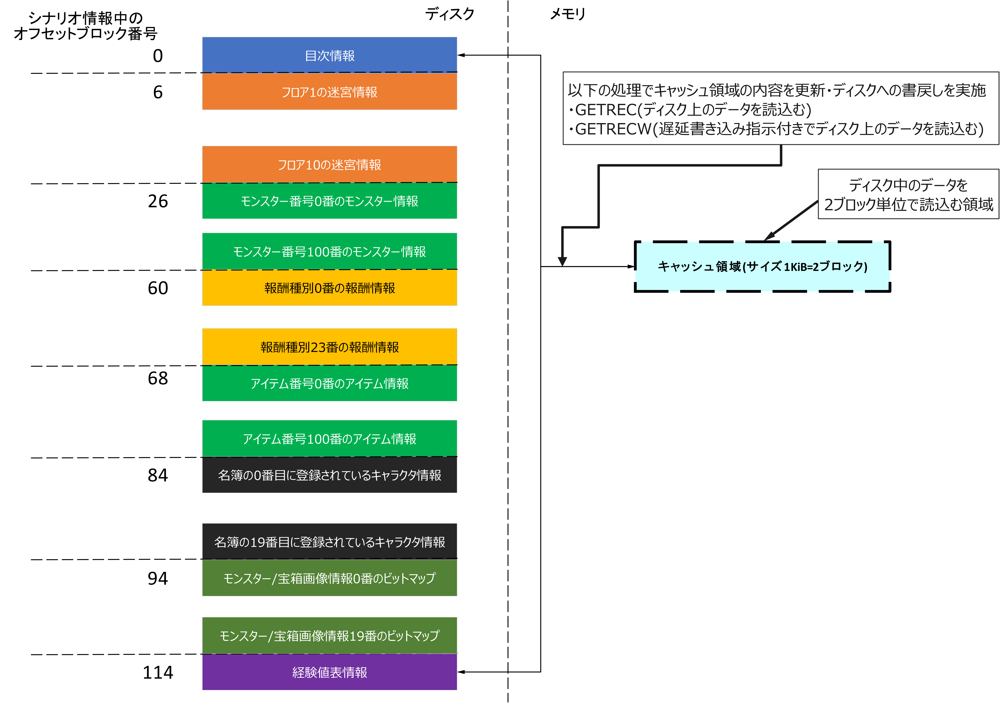
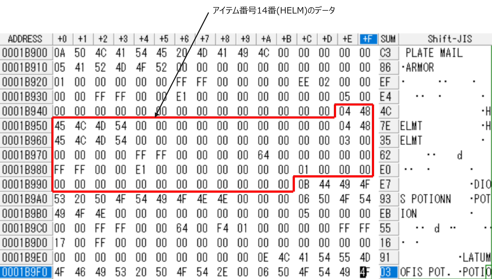

## 全体構成

本節では, AppleII版 Wizardryのシナリオ情報ファイル(`SCENARIO.DATA`)の構成について述べる。

シナリオ情報ファイルは, 以下の部分から構成される。

1. シナリオ情報共通部
2. 迷宮フロア情報
3. モンスター情報
4. 報酬情報
5. アイテム情報
6. キャラクター名簿情報
7. モンスター/宝箱画像情報
8. 経験値表情報

### シナリオ情報共通部の構造

シナリオ情報共通部は, シナリオ情報ファイルの先頭からブロック単位に以下のように分割して順番に配置される。

|オフセットブロック(単位:ブロック)|シナリオ情報ファイル先頭からのオフセットアドレス(単位:バイト)|格納されている情報|
|---|---|---|
|0|0|目次情報|
|1|512|高解像度モード (Hi-Res)用キャラクタセットイメージ情報(通常文字)|
|2|1024|高解像度モード (Hi-Res)用キャラクタセットイメージ情報(全滅時文字)|
|3|1536|プロテクトコード|
|4|2048|魔術師呪文名一覧|
|5|2560|僧侶呪文名一覧|

上記のうちプロテクトコードについては, 本稿では取り扱わない。

### 迷宮フロア情報, モンスター情報, アイテム情報, キャラクター名簿の構造

シナリオ情報ファイル中の以下の情報は, ディスク上の連続する1KiB分のディスクブロック(2ブロック)を単位として格納されている。

1. 迷宮フロア情報
2. モンスター情報
3. アイテム情報情報
4. キャラクター名簿情報

各情報のデータ長に応じて, 1KiBに格納可能な個数のデータが連続して各領域に格納される。1KiB以内に全てのデータを格納できない場合は, 次の1KiBのデータブロック境界から, データを格納を再開する。

シナリオ情報は, 一度メモリ中のキャッシュ領域に読み込まれ, プログラム中からはキャッシュ領域中のデータを参照することで, シナリオ情報の内容にアクセスする。

#### AppleII版 Wizardryでのキャッシュ領域の扱い

AppleII版 Wizardryでは, キャッシュ領域は, 以下のような1KiBのバイト配列(CHAR型の配列)として定義されている:

```:pascal
IOCACHE  : PACKED ARRAY[ 0..1023] OF CHAR;
```

シナリオ情報の各要素には, 以下の列挙型`TZSCN`で定義されたシナリオ情報種別を表す列挙子がつけられている。

```:pascal
        TZSCN = (ZZERO, ZMAZE, ZENEMY, ZREWARD, ZOBJECT,
                        ZCHAR, ZSPCCHRS, ZEXP); (* シナリオ情報種別 *)
```

シナリオ情報種別と格納されている情報の関係は以下の通り:

|列挙子|列挙値|意味|シナリオ1での総要素数|
|---|---|---|---|
|ZZERO|0|シナリオ情報の目次情報(目次情報)|1|
|ZMAZE|1|迷宮内の各フロアのマップ, フロア内のイベント情報(迷宮フロア情報)|10|
|ZENEMY|2|各モンスターのパラメタ値(モンスター情報)|101|
|ZREWARD|3|宝箱から得られるお金, アイテムの情報(報酬情報)|24|
|ZOBJECT|5|各アイテムのパラメタ値(アイテム情報)|101|
|ZCHAR|6|訓練場で作成したキャラクタの情報(キャラクタ名簿情報)|20|
|ZSPCCHRS|7|魔物/宝箱/報酬のグラフィック(モンスター/宝箱画像情報)|20|
|ZEXP|8|各職業で次のレベルに上がるための累積経験値, レベル13からレベル14に上がるための差分経験値を格納した表(経験値表情報)|1|

プログラム中で, GETREC関数, GETRECW関数を用いることで, ディスク上のシナリオ情報が, メモリ中のキャッシュ領域(IOCACHE変数)に読み込まれる(下図参照)。



GETREC, GETRECWは, 読みだす情報のシナリオ情報種別と対象情報種別内での連番, データ長を指定することで読込み対象の情報をキャッシュ領域に読み込み, 読込み対象の情報のキャッシュ領域内でのオフセットアドレスを返却する関数である。

GETREC, GETRECWの返却値をIOCACHE変数の添え字に指定することで, シナリオ情報中のデータ構造にアクセスすることができる。

GETREC, GETRECWは, 現在キャッシュ中に読み込まれているディスク上のブロックを大域変数`CACHEBL`に保持しており, 同一のディスクブロックからの読み出し時には, ディスクへのアクセスを抑止することで, ディスクI/O負荷を軽減する。

キャッシュ領域中のシナリオ情報をディスク上に書き戻す場合は,
GETRECW関数を用いて, 更新対象のデータをキャッシュ中に読み込む。 GETRECW関数呼び出すと, キャッシュ領域の書き戻し要求フラグ(`CACHEWRI`大域変数)がセットされる。

後続のGETREC, GETRECWの呼び出しに伴い, 現在キャッシュ領域に格納されているブロック群(2ブロック)と異なるディスクブロックからデータを読み出す際に, キャッシュ領域の内容をディスク上に書き戻してから要求されたブロックの内容をキャッシュ領域に読み込む。

例えば, ギルガメッシュの酒場でのパーティメンバの追加など, シナリオ情報への書き戻しが必要な場合は, GETREC関数を使用して, データを読み込んだ後, GETRECWを使用してデータの書き戻しを指示する。 これにより, (名簿参照やアイテム情報参照に伴う)後続のGETREC呼び出し時に, 更新後のパーティメンバ編成など更新があった情報がディスクに書き戻される。

#### ディスク上のシナリオ情報読み取り開始ブロック算出式

キャッシュ領域中には, ディスク上で2ブロック分の情報が格納される。このため, ディスク上のブロック読込開始位置(単位:ブロック)は, 以下の式で算出される。

```:text
ブロック読込開始位置(シナリオ情報開始ブロックからの相対ブロック数) = ディスク上でのブロックオフセット + 2 * ( データエントリのインデクス(配列の添え字) / キャッシュ領域に格納可能なデータ数 )
```

#### キャッシュ領域内の読み取り対象データ格納位置算出式

キャッシュ領域内の読み取り対象データ格納位置は, 以下の式で算出される。以下で算出される値は, キャッシュ領域の戦闘アドレスからのオフセットアドレス(単位:バイト)であり, キャッシュ領域を表す大域変数IOCACHE配列の添え字として用いられる。

```:text
キャッシュ領域内でのオフセットアドレス = データサイズ * ( データエントリのインデクス(配列の添え字) % キャッシュ領域に格納可能なデータ数 )
```

#### シナリオ情報中のデータ参照処理の例

例えば, アイテム情報14番(HELM)の場合, アイテム情報1エントリ当たりのサイズが78バイトであること, キャッシュ領域のサイズが1KiB(1024バイト)であることから, キャッシュ領域に格納可能なデータ(アイテム情報)の数は, 以下の式により13個となる:

```:text
キャッシュ領域に格納可能なデータ(アイテム情報)の数 = キャッシュ領域サイズ / アイテム情報のデータサイズ = 1024 / 78 = 13
```

ブロック読込開始位置算出式, キャッシュ領域内の読み取り対象データ格納位置算出式で用いるパラメタは以下のようになる:

- ディスク上でのブロックオフセット(単位:ブロック): 68
- データエントリのインデクス(配列の添え字): 14
- データサイズ(単位:バイト): 78
- キャッシュ領域に格納可能なデータ数: 13

ブロック読込開始位置は以下のように算出される:

```:text
ブロック読込開始位置(シナリオ情報開始ブロックからの相対ブロック数) = 68 + 2 * ( 14 / 13 ) = 68 + 2 * 1 = 70ブロック
```

キャッシュ領域内でのオフセットアドレスは以下のように算出される:

```:text
キャッシュ領域内でのオフセットアドレス = 78 * ( 14 % 13 ) = 78 * 1 = 78
```

上記から, 70ブロック目は偶数ブロックであるため, キャッシュ領域には, 70ブロックから71ブロックの内容が格納され, キャッシュ領域のオフセット位置78バイト目の位置に, HELMの情報が格納される。

ディスク上のシナリオ情報中の70ブロック目の内容は, 以下のようになっており, 上記の式で算出されたオフセット78バイト目(16進数で0x4E)の位置に, HELMの情報が格納されていることが確認できる。


